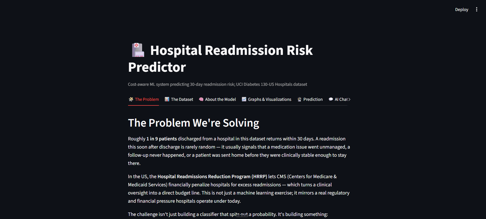
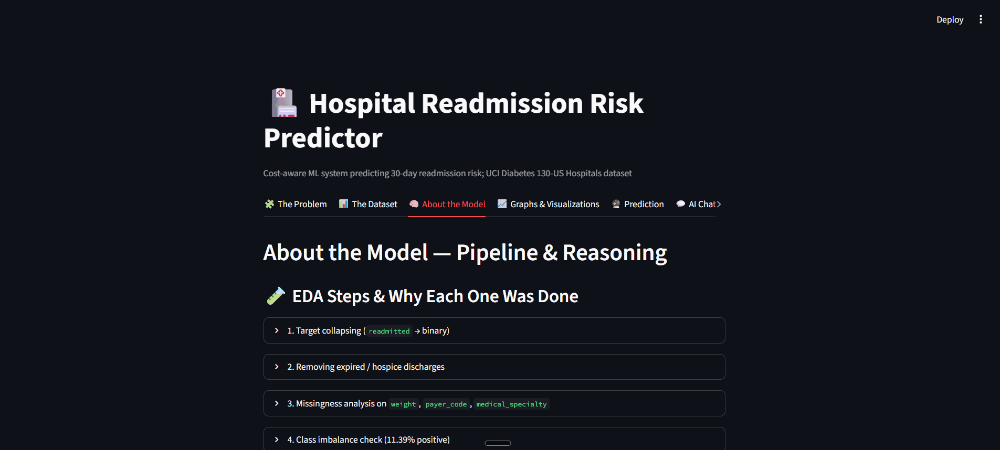
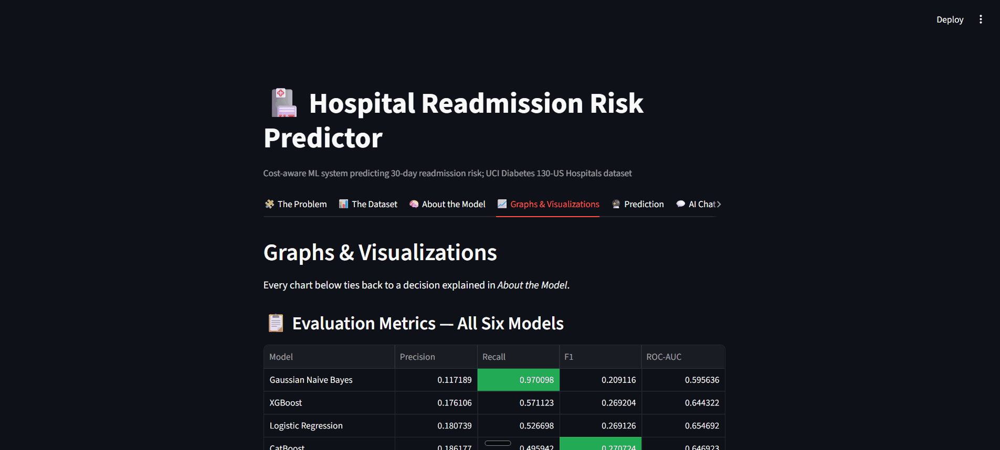
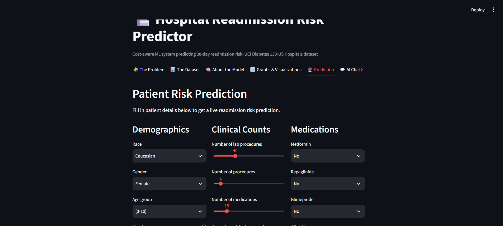
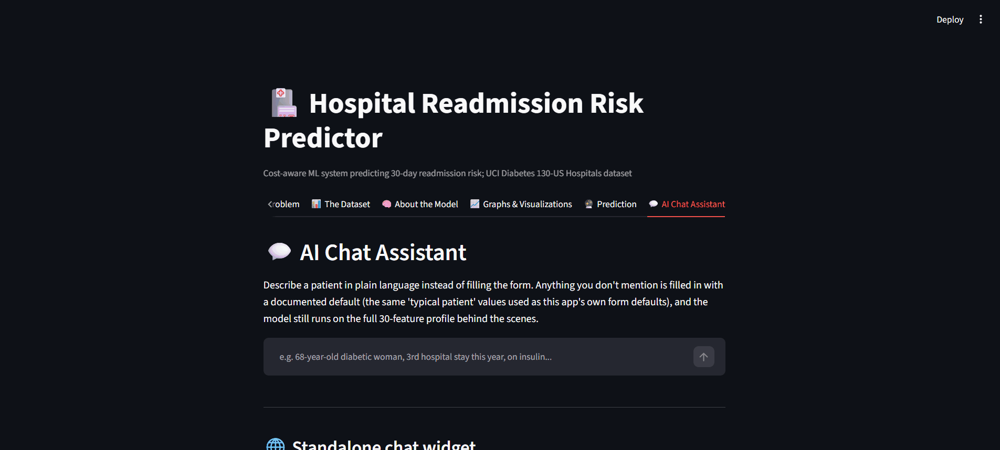

# Hospital Readmission Risk & Cost Prediction

A full-stack machine learning project for predicting 30-day hospital readmission risk, comparing models through a cost-aware lens, and surfacing actionable insights through a Streamlit dashboard and FastAPI backend.


**[Live app →](#)** *https://readmission-project-prediction-yomnasabry.streamlit.app/*

---

## Table of contents

- [Overview](#overview)
- [Why this matters](#why-this-matters)
- [Live demo](#live-demo)
- [Dataset](#dataset)
- [Repository structure](#repository-structure)
- [Features](#features)
- [Tech stack](#tech-stack)
- [Setup](#setup)
- [Running the app locally](#running-the-app-locally)
- [API endpoints](#api-endpoints)
- [Notes on modeling](#notes-on-modeling)
- [License](#license)

---

## Overview

This project tackles a practical hospital problem: identifying which patients are most likely to be readmitted within 30 days after discharge and turning that prediction into a decision-support tool for case management.

It's built as a complete, end-to-end pipeline rather than a single notebook: raw data goes in one end, and a deployed, interactive risk-prediction tool comes out the other. Concretely, this repo contains:

- **Two Jupyter notebooks** that take the raw UCI dataset through cleaning, feature engineering, encoding, model training, and cost-based model selection — fully reproducible, with every decision explained inline.
- **Six trained models** compared against each other (Logistic Regression, Decision Tree, Random Forest, XGBoost, CatBoost, Gaussian Naive Bayes), evaluated not just on accuracy but on what a wrong prediction actually costs a hospital.
- **A FastAPI backend** (`app/main.py`) that serves the winning model as a REST API, so it can be called from anywhere — a hospital's EHR system, a script, or the dashboard below.
- **A Streamlit dashboard** (`app/streamlit_app.py`) that wraps all of the above into something a non-technical user (a case manager, a clinician) could actually open and use: dataset explanation, model reasoning, visual results, a live prediction form, and an AI chat assistant.
- **A Groq-powered explanation layer** (`app/chatbot.py`) that turns a raw probability into a plain-language note a case manager can act on, and can also hold a free-text conversation to fill in a patient's details.

If you clone this repo, you should be able to: retrain the models yourself from the notebooks, run the API and dashboard locally, hit the `/predict` endpoint with your own patient data, and understand *why* the model behaves the way it does — not just that it works.

## Why this matters

Readmissions are expensive for hospitals and often reflect unmet follow-up needs, medication issues, or discharge instability. The goal is not only to classify patients, but to help hospitals prioritize limited follow-up resources more effectively.

The project is designed around three business decisions:

1. Which patients should receive a follow-up call
2. Which model is worth deploying for real-world use
3. Which probability threshold should trigger an alert

## Live demo

The dashboard is deployed on Streamlit Cloud and organized into five tabs. Below is a walkthrough of each.

### 1. The Problem & The Dataset

Context on the business problem, plus a full breakdown of the UCI Diabetes 130-US Hospitals dataset — sources, raw vs. cleaned encounters, and feature groups.



### 2. About the Model

Pipeline reasoning end to end: EDA decisions, target collapsing, missingness handling, feature engineering, encoding, and why each modeling choice was made.



### 3. Graphs & Visualizations

ROC curves, confusion matrices, threshold curves, and cost-based comparisons across models.



### 4. Prediction

Interactive form for entering patient details and getting a live 30-day readmission risk score with an AI-generated risk note.



### 5. AI Chat

Conversational interface that extracts patient fields from free text, fills in sensible defaults, and generates a full risk report via Groq.



## Dataset

The project uses the UCI Diabetes 130-US Hospitals dataset, covering inpatient encounters from 130 US hospitals between 1999 and 2008.

Key details:

- Raw encounters: 101,766
- Retained after cleaning: 99,343
- Target: binary 30-day readmission flag
- Positive class rate: about 11.39%

The dataset includes demographic, admission, diagnosis, medication, lab, and prior-utilization features. Roughly, the feature groups are:

- **Demographics** — race, gender, age bracket
- **Admission context** — admission type, discharge disposition, admission source, time in hospital
- **Clinical load** — number of lab procedures, procedures, medications, and diagnoses per encounter
- **Prior utilization** — outpatient, emergency, and inpatient visit counts before this encounter (strong readmission signal)
- **Diagnoses** — up to three ICD-9 diagnosis codes per encounter, grouped into clinical categories (e.g. Circulatory, Diabetes, Respiratory)
- **Medications** — 20+ diabetes-related drug columns (metformin, insulin, etc.) tracking whether a drug was prescribed, changed, or stopped

One important framing decision: the raw `readmitted` column has three values (`<30`, `>30`, `NO`). This project collapses it into a **binary target** — readmitted within 30 days vs. not — because that's the window hospitals are actually penalized for and can realistically intervene on.

A number of other preprocessing choices were made to preserve information while keeping the modeling pipeline faithful to the underlying problem — see [Notes on modeling](#notes-on-modeling) below.

Sources:

- [UCI Machine Learning Repository](https://archive.ics.uci.edu/dataset/296/diabetes+130-us+hospitals+for+years+1999-2008)
- [Kaggle mirror](https://www.kaggle.com/datasets/brandao/diabetes)
- Strack et al. (2014), *Impact of HbA1c Measurement on Hospital Readmission Rates*

## Repository structure

```text
readmission-project/
├── assets/
│   └── screenshots/           # Demo GIFs used in this README
│       ├── 01-problem-dataset.gif
│       ├── 02-model.gif
│       ├── 03-visuals.gif
│       ├── 04-predictor.gif
│       └── 05-chatbot.gif
├── app/
│   ├── main.py                # FastAPI backend with prediction and report endpoints
│   ├── streamlit_app.py       # Interactive Streamlit dashboard
│   ├── chatbot.py             # Chat extraction/default-filling/report generation logic
│   ├── static/                # Static assets for the frontend widget
│   └── *.pkl                  # Trained model artifacts
├── data/
│   ├── diabetic_data.csv
│   ├── diabetic_data_engineered.csv
│   └── ids_mapping.csv
├── notebooks/
│   ├── 01_eda_feature_engineering.ipynb
│   └── 02_preprocessing_modeling.ipynb
├── requirements.txt
└── LICENSE
```

## Features

- **Cost-aware model comparison** — six models judged on what a wrong prediction actually costs, not just accuracy, with a full threshold sweep to find the real optimal cutoff (see [Notes on modeling](#notes-on-modeling))
- **A callable prediction service** — the FastAPI backend means the model isn't locked inside a notebook or a single dashboard; anything that can send JSON can get a risk score
- **A dashboard anyone can use** — five Streamlit tabs walk a non-technical reader from "what's the problem" through "here's the dataset" to "here's a live prediction," so the reasoning isn't hidden behind code
- **Plain-language risk notes, not just probabilities** — a raw 0.42 doesn't mean anything to a case manager; the Groq layer turns it into something actionable
- **A conversational fallback** — if someone doesn't have structured data handy, the chat assistant extracts what it can from free text and fills gaps with reasonable defaults instead of failing
- **Fully reproducible from raw data** — the two notebooks take you from the untouched UCI CSV all the way to the trained artifacts shipped in `app/`, so nothing here is a black box

## Tech stack

- Python
- pandas, NumPy, scikit-learn
- XGBoost and CatBoost
- FastAPI
- Streamlit
- Groq for LLM-generated explanations

## Setup

### 1. Clone the repository

```bash
git clone https://github.com/<your-username>/readmission-project.git
cd readmission-project
```

### 2. Create and activate a virtual environment

```bash
python -m venv venv
source venv/bin/activate
```

On Windows PowerShell:

```powershell
venv\Scripts\Activate.ps1
```

### 3. Install dependencies

```bash
pip install -r requirements.txt
```

### 4. Set the Groq API key (optional but recommended)

```bash
export GROQ_API_KEY=your_key_here
```

On Windows PowerShell:

```powershell
$env:GROQ_API_KEY="your_key_here"
```

If the key is not set, the app falls back to rule-based or default-generated text instead of failing completely.

## Running the app locally

### Start the FastAPI backend

From the project root:

```bash
cd app
uvicorn main:app --reload
```

The API will be available at http://127.0.0.1:8000.

### Launch the Streamlit dashboard

In a second terminal, from the project root:

```bash
streamlit run app/streamlit_app.py
```

## API endpoints

The FastAPI backend is what actually makes this usable outside the dashboard — you can hit it from any system that can send a POST request (an EHR integration, a script, a different frontend entirely). It exposes:

- `POST /predict` — send structured patient data, get back a readmission probability plus a short, plain-language risk note (no Groq call needed for the core prediction)
- `POST /chat` — send free text (e.g. a clinical note or a case manager's description of the patient) and it extracts the structured fields itself before scoring, filling in sensible defaults for anything missing
- `POST /report` — same patient context as `/predict`, but returns a longer AI-generated narrative report suitable for a case file rather than a one-line note

Example request payload for `/predict`:

```json
{
  "race": "Caucasian",
  "gender": "Female",
  "age": "[70-80)",
  "weight": "Missing",
  "time_in_hospital": 5,
  "payer_code": "Missing",
  "admission_type_desc": "Emergency",
  "discharge_disposition_desc": "Discharged to home",
  "admission_source_desc": "Emergency Room",
  "num_lab_procedures": 45,
  "num_procedures": 2,
  "num_medications": 12,
  "number_outpatient": 0,
  "number_emergency": 1,
  "number_inpatient": 2,
  "number_diagnoses": 8,
  "total_prior_visits": 3,
  "max_glu_serum": "Missing",
  "A1Cresult": "Missing",
  "metformin": "No",
  "repaglinide": "No",
  "glimepiride": "No",
  "glipizide": "No",
  "glyburide": "No",
  "pioglitazone": "No",
  "rosiglitazone": "No",
  "insulin": "No",
  "change": "No",
  "diabetesMed": "Yes",
  "num_meds_changed": 0,
  "diag_1_group": "Circulatory",
  "diag_2_group": "Diabetes",
  "diag_3_group": "Other",
  "diabetes_related": 1
}
```

## Notes on modeling

The notebooks contain the full exploration pipeline, in this order:

1. EDA and target collapsing (`readmitted` → binary)
2. Missing value analysis and handling (`weight`, `payer_code`, `medical_specialty`)
3. Feature engineering
4. Column dropping
5. Encoding
6. Train/test splitting
7. Preprocessing (scaling)
8. Modeling and comparison of six model families
9. Cost-based evaluation and threshold selection

### Why accuracy alone was rejected

Only about 11.4% of encounters are actually readmitted within 30 days. A model that just predicts "not readmitted" every time would already be ~89% accurate and completely useless — it would never catch the patients who actually need a follow-up call. So every model here is judged primarily on **recall** (catching true positives) and, ultimately, on **cost**, not raw accuracy.

### Model comparison (test set)

| Model | Precision | Recall | F1 | ROC-AUC |
|---|---|---|---|---|
| Logistic Regression | 0.181 | 0.527 | 0.269 | **0.655** |
| Random Forest | 0.401 | 0.034 | 0.062 | 0.657 |
| CatBoost | 0.186 | 0.496 | 0.271 | 0.647 |
| XGBoost | 0.176 | 0.571 | 0.269 | 0.644 |
| Gaussian Naive Bayes | 0.117 | **0.970** | 0.209 | 0.596 |
| Decision Tree | 0.148 | 0.188 | 0.165 | 0.523 |

ROC-AUC alone would nudge you toward Random Forest — but its recall (0.034) means it misses almost every true readmission, which is exactly the failure mode this project is trying to avoid.

### Choosing by cost, not accuracy

Each model was re-evaluated by assigning an estimated cost to false negatives (a readmission the hospital didn't see coming — expensive) versus false positives (an unnecessary follow-up call — cheap by comparison). At the default 0.5 threshold:

| Model | False Negatives | False Positives | Estimated Total Cost |
|---|---|---|---|
| **XGBoost** | 1,004 | 6,255 | **$8,147,500** |
| Logistic Regression | 1,108 | 5,589 | $8,334,500 |
| CatBoost | 1,180 | 5,075 | $8,437,500 |
| Gaussian Naive Bayes | 63 | 17,190 | $8,910,000 |
| Decision Tree | 1,901 | 2,542 | $10,776,000 |
| Random Forest | 2,262 | 118 | $11,369,000 |

XGBoost comes out lowest-cost at the default cutoff. From there, the decision threshold itself (the probability cutoff that triggers an alert) was swept from 0.05 to 0.90 and re-costed at each point — the U-shaped curve bottoms out around **threshold 0.40**, below the default 0.5, meaning the deployed model is tuned to flag patients slightly more aggressively than a naive cutoff would, because under this cost structure a missed readmission is worse than an extra phone call.

The deployed app runs on this trained, cost-tuned model artifact, with the Groq-powered layer on top translating each raw probability into a plain-language risk note.

## Contributors
| Contributor | GitHub |
|---|---|
|  | [Yomna Sabry](https://github.com/YomnaSabry172) |
|  | [Ahmed Mohamed Ghareeb](https://github.com/ahmedmohamed1807) |
|  | [Mennaallah Mohammed](https://github.com/mennaallah275) |
|  | [Fady Nasser](https://github.com/fadynasser729-cpu) |
|  | [Hana Hassan](https://github.com/hanahassan7) |


## Instructors

Thanks to our instructors for their guidance throughout this project:

- [Fady Atia](https://www.linkedin.com/in/fady-atia-09144520b)
- [Kerollos George](https://www.linkedin.com/in/kerllose-goerge-300112233)
- [Mohamed Abdelghany](https://www.linkedin.com/in/mabghany)
- [Khaled Mohamed](https://www.linkedin.com/in/khaled-mohamed-753855284)

## License

This project is licensed under the MIT License. See [LICENSE](LICENSE).
